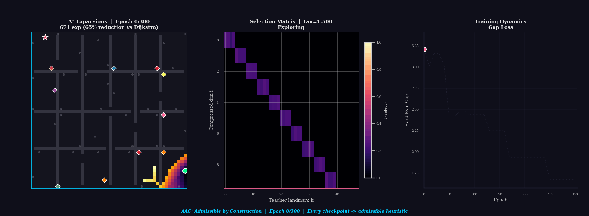

# AAC: Admissible-by-Architecture Differentiable Landmark Compression for ALT

[](https://arxiv.org/abs/2604.20744)
[](https://github.com/anindex/aac/actions/workflows/ci.yml)
[](https://www.python.org/downloads/)
[](https://pytorch.org/)

**AAC** is a differentiable landmark-selection module for [ALT](https://en.wikipedia.org/wiki/A*_search_algorithm#Landmarks_and_triangle_inequality) (A\*, Landmarks, and Triangle inequality) shortest-path heuristics. It compresses a large set of teacher landmarks into a small, search-efficient subset via gradient descent -- and its outputs are **admissible by construction**: a row-stochastic compression matrix produces convex combinations of triangle-inequality lower bounds, so the heuristic is admissible for *every* parameter setting, at *every* training epoch, without convergence assumptions or post-hoc calibration.

At deployment the module reduces to classical ALT on the learned subset, preserving the full classical toolchain (BPMX, bound substitution, bidirectional search).

> **Paper:** *"AAC: An Admissible-by-Architecture Differentiable Compressor for Learned ALT Landmark Selection"* -- An T. Le and Vien Ngo ([arXiv:2604.20744](https://arxiv.org/abs/2604.20744)).

<p align="center">
  
  <br>
  <em>AAC training on a 50×50 maze, compressing 48 FPS landmarks to 10. Left: A* expansion heatmap with teacher landmarks (gray dots) and learned AAC landmarks (colored diamonds). Middle: selection matrix sharpening from diffuse to one-hot. Right: heuristic gap loss converging. The heuristic is admissible at every frame.</em>
</p>

## How AAC Works

<p align="center">
  
</p>

AAC learns *which* landmarks matter by parameterizing a row-stochastic compression matrix **A** over a pool of K teacher landmarks (selected by farthest-point sampling). Each of the m output dimensions is a convex combination of teacher distances. Since a convex combination of admissible lower bounds is itself admissible (Proposition 1 in the paper), the compressed heuristic is admissible for every value of **A** -- not just at convergence, but at initialization and every intermediate checkpoint.

During training, Gumbel-softmax annealing sharpens each row of **A** from a diffuse mixture toward a one-hot selection, so the final model selects a discrete landmark subset. The training objective minimizes the gap between the learned heuristic and the teacher, driving the selected landmarks toward those that most reduce A\* node expansions.

### Compression Architectures

AAC provides three compression architectures, all with provable admissibility guarantees:

| Architecture | Mechanism | Guarantee | Use Case |
|---|---|---|---|
| **LinearCompressor** (primary) | Row-stochastic Gumbel-softmax selection | Convex combination ≤ max (Prop. 1) | Standard landmark selection |
| **LipschitzCompressor** | 1-Lipschitz neural network (GroupSort + spectral norm) | L∞ contraction (Theorem) | Nonlinear compression |
| **PositiveCompressor** | Log-domain max-plus contraction | Max-plus contraction | Tropical embedding compression |

### What Makes AAC Landmarks Different from FPS Landmarks

Standard [farthest-point sampling](https://en.wikipedia.org/wiki/Farthest-first_traversal) (FPS) places landmarks to maximize geometric spread -- a reasonable spatial heuristic, but one that is entirely query-agnostic and cannot adapt to graph structure. AAC landmarks are selected by gradient descent to minimize search cost, which means they concentrate on structurally important locations (corridor junctions, bottleneck edges) rather than simply maximizing pairwise distance.

| | FPS Landmarks | AAC Landmarks |
|---|---|---|
| **How selected** | Greedy farthest-point sampling | Gradient-based differentiable selection |
| **Optimizes for** | Spatial coverage (max-min distance) | Search efficiency (min A\* expansions) |
| **Adapts to graph** | No -- fixed once computed | Yes -- learns bottleneck structure |
| **Memory** | Full K landmarks | Compressed subset m ≪ K |
| **Admissibility** | By triangle inequality | By construction (convex combination) |

### Why This Matters in Practice

- **Memory-constrained deployment:** Compress a large landmark table (e.g., K=48 → m=10) for onboard robot planning. On the maze above this yields 4.8× memory reduction while retaining 88% expansion savings over uninformed search.
- **End-to-end differentiability:** Gradients flow through the heuristic, enabling joint optimization with upstream modules such as graph construction or edge-weight learning.
- **Anytime admissibility:** Every intermediate checkpoint produces a valid admissible heuristic. A partially-trained model can be deployed immediately -- no waiting for convergence, no post-hoc verification.

<p align="center">
  
  <br>
  <em>A* search expansions: Dijkstra (no heuristic) vs ALT (K=16 landmarks) vs AAC (m=16 from K₀=32). At matched memory, AAC achieves competitive search focus through learned landmark selection.</em>
</p>

## Key Results

Under a matched per-vertex memory protocol on 9 road networks + 3 synthetic graph families:

| Metric | Finding |
|--------|---------|
| **Expansion count** | FPS-ALT leads AAC by 0.9-3.9 pp on roads, ≤1.3 pp on synthetic graphs |
| **Query latency** | AAC is **1.24-1.51x faster** than FPS-ALT at p50 on every DIMACS graph |
| **Admissibility** | Zero violations across every checkpoint, every parameter setting, by construction |
| **Amortization** | AAC's offline cost amortizes within 170-1,924 queries per graph |
| **Binding constraint** | Training-objective drift, not architecture; identity initialization closes the gap |

## Installation

```bash
# From source (Python 3.11+, PyTorch 2.12+)
pip install -e ".[dev,experiments]"

# Or with conda:
conda env create -f environment.yml
conda activate aac

# Or with uv (recommended):
uv sync
```

**Hardware used in the paper:** Intel Core Ultra 9 285K (CPU experiments), NVIDIA RTX 5090 (Warcraft contextual training), 128 GB RAM.

## Quick Start

Three self-contained demos -- no dataset downloads needed:

```bash
# Grid navigation with obstacles
python examples/demo_grid_navigation.py

# Road routing with memory-accuracy tradeoff
python examples/demo_road_routing.py

# End-to-end differentiable terrain routing
python examples/demo_terrain_routing.py
```

**Grid navigation output (matched memory, K=16 vs m=16):**
```
[Dijkstra]  Cost: 28.04  Expansions: 253
[ALT K=16]  Cost: 28.04  Expansions: 36   (85.8% reduction)
[AAC m=16]  Cost: 28.04  Expansions: 55   (78.3% reduction)

Memory: ALT = 16 values/vertex, AAC = 16 values/vertex (matched)
All paths optimal (cost = 28.04)
```

## Reproduction

```bash
# Full pipeline: all experiments + tables + figures + verification (~hours)
python scripts/reproduce_paper.py

# Fast: regenerate tables and figures from existing CSVs (seconds)
python scripts/reproduce_paper.py --tables-only

# Single track (see --help for the 11 valid tracks)
python scripts/reproduce_paper.py --track dimacs
python scripts/reproduce_paper.py --track osmnx
python scripts/reproduce_paper.py --track synthetic
```

**Step 0: Download all datasets** (run once, ~400 MB total):
```bash
python scripts/download_all_data.py            # all datasets
python scripts/download_all_data.py --dimacs    # DIMACS road graphs only
python scripts/download_all_data.py --osmnx     # OSMnx city/country graphs only
python scripts/download_all_data.py --warcraft  # Warcraft terrain maps only
```

## Repository Layout

```
src/
  aac/                   -- core library
    compression/         -- LinearCompressor, LipschitzCompressor, PositiveCompressor,
                            DualCompressor, smooth heuristic construction
    search/              -- A* (with BPMX), Dijkstra, bidirectional A*, batch search
    baselines/           -- ALT, CDH, FastMap reference implementations
    embeddings/          -- FPS anchor selection, SSSP teacher labels,
                            Hilbert and tropical embeddings
    contextual/          -- end-to-end differentiable pipeline
                            (encoder -> Bellman-Ford -> compress -> heuristic)
    train/               -- training loop (gap-closing loss, Gumbel-softmax annealing),
                            data utilities, fused AdamW optimizer
    viz/                 -- publication-quality visualization (Okabe-Ito palette)
    graphs/              -- graph types (CSR), I/O (NPZ), loaders
                            (DIMACS, OSMnx, Warcraft, PBF, MovingAI)
    semirings/           -- tropical and smooth semiring operations with autograd
    utils/               -- numerics (sentinel handling, safe log/exp),
                            memory accounting, compilation helpers
  experiments/           -- Hydra-configured experiment runners
                            (DIMACS, OSMnx, Warcraft, Cabspotting)
scripts/                 -- experiment scripts, figure/table generators
                            (50+ scripts, see scripts/README.md)
tests/                   -- pytest suite (25 modules, 360+ tests)
results/                 -- experiment outputs (CSVs, logs); see results/README.md
examples/                -- three self-contained demos (no dataset downloads)
```

For the per-experiment file index and provenance chain, see [`results/README.md`](results/README.md).

## Performance & Optimizations

AAC incorporates several optimizations for efficient training and inference:

- **Fused AdamW optimizer:** Training uses `torch.optim.AdamW(fused=True)` on CUDA for single-kernel parameter updates (~20% training speedup).
- **CSR graph representation:** All graphs use sparse CSR format with pre-converted Python lists in the A\* and bidirectional A\* inner loops, avoiding `Tensor.item()` overhead (~10x per-expansion speedup).
- **Direct index selection at inference:** Eval-mode compression uses array indexing instead of matmul with one-hot matrix, eliminating float32 rounding errors that could violate admissibility.
- **Sentinel-aware fast paths:** Heuristic evaluation detects sentinel-free graphs at construction time and skips per-query masking (~2x speedup on well-connected graphs).
- **Streamlined training loop:** Direct tensor indexing replaces `torch.unique` + scatter mapping for training batch construction.
- **Numerical stability:** All log-domain operations use `torch.logsumexp` with shift-stabilization; sentinel values (1e18) prevent inf-inf NaN propagation.

## Citation

If you find this work useful, please consider citing:

```bibtex
@article{le2026aac,
  title={AAC: An Admissible-by-Architecture Differentiable Compressor for Learned ALT Landmark Selection},
  author={Le, An T. and Ngo, Vien A.},
  journal={arXiv preprint arXiv:2604.20744},
  year={2026}
}
```

## License

Copyright © 2026 An T. Le. All Rights Reserved.

This code is provided solely for academic peer-review and reproducibility purposes. No license is granted for commercial or derivative use.
