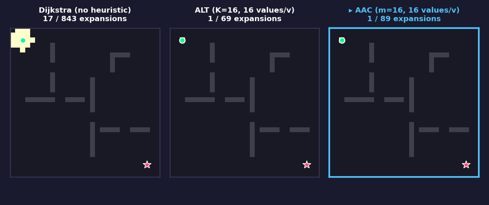
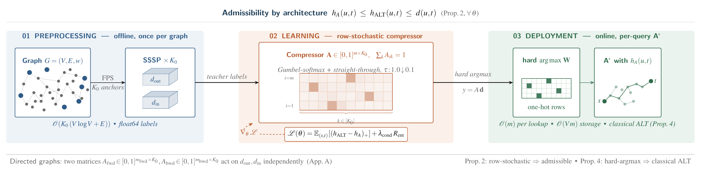

# AAC: Admissible-by-Architecture Differentiable Landmark Compression for ALT

[](https://arxiv.org/abs/2604.20744)
[](https://www.python.org/downloads/)
[](https://pytorch.org/)

<p align="center">
  
  <br>
  <em>A* search expansions on a 2D grid: Dijkstra (no heuristic) vs ALT (K=16 landmarks) vs AAC (m=16 from a K₀=32 pool). At matched memory AAC achieves competitive search focus through learned landmark selection.</em>
</p>

**AAC** is a differentiable landmark-selection module for [ALT](https://en.wikipedia.org/wiki/A*_search_algorithm#Landmarks_and_triangle_inequality) (A\*, Landmarks, and Triangle inequality) shortest-path heuristics whose outputs are **admissible by construction**: each forward pass is a row-stochastic mixture of triangle-inequality lower bounds, so the heuristic is admissible for *every* parameter setting -- no convergence assumption, no calibration step, no projection.

At deployment the module reduces to classical ALT on a learned landmark subset, so the classical toolchain (BPMX, bound substitution, bidirectional search) remains available.

> **Paper:** *"AAC: An Admissible-by-Architecture Differentiable Compressor for Learned ALT Landmark Selection"* -- An T. Le and Vien Ngo ([arXiv:2604.20744](https://arxiv.org/abs/2604.20744)).

## Key Results

Under a matched per-vertex memory protocol on 9 road networks + 3 synthetic graph families:

| Metric | Finding |
|--------|---------|
| **Expansion count** | FPS-ALT leads AAC by 0.9-3.9 pp on roads, ≤1.3 pp on synthetic graphs |
| **Query latency** | AAC is **1.24-1.51x faster** than FPS-ALT at p50 on every DIMACS graph |
| **Admissibility** | Zero violations across every checkpoint, every parameter setting, by construction |
| **Amortization** | AAC's offline cost amortizes within 170-1,924 queries per graph |
| **Binding constraint** | Training-objective drift, not architecture; identity initialization closes the gap |

## Installation

```bash
# From source (Python 3.11+)
pip install -e ".[dev,experiments]"

# Or with conda:
conda env create -f environment.yml
conda activate aac

# Or with uv:
uv sync
```

**Hardware used in the paper:** Intel Core Ultra 9 285K (CPU experiments), NVIDIA RTX 5090 (Warcraft contextual training), 128 GB RAM.

## Quick Start

Three self-contained demos -- no dataset downloads needed:

```bash
# Demo 1: Grid navigation with obstacles
python examples/demo_grid_navigation.py

# Demo 2: Road routing with memory-accuracy tradeoff
python examples/demo_road_routing.py

# Demo 3: End-to-end differentiable terrain routing
python examples/demo_terrain_routing.py
```

**Demo 1 output (matched memory, K=16 vs m=16):**
```
[Dijkstra]  Cost: 28.04  Expansions: 253
[ALT K=16]  Cost: 28.04  Expansions: 36   (85.8% reduction)
[AAC m=16]  Cost: 28.04  Expansions: 55   (78.3% reduction)

Memory: ALT = 16 values/vertex, AAC = 16 values/vertex (matched)
All paths optimal (cost = 28.04)
```

## How AAC Works

<p align="center">
  
</p>

**Key insight:** The row-stochastic constraint on the compression matrix *A* means each compressed dimension is a convex combination of teacher distances. A convex combination of admissible lower bounds is itself an admissible lower bound -- this holds for **every** parameter setting, at **every** training epoch, by construction (Proposition 1 in the paper).

## Reproduction

```bash
# Full pipeline: all experiments + tables + figures + verification (~hours)
python scripts/reproduce_paper.py

# Fast: regenerate tables and figures from existing CSVs (seconds)
python scripts/reproduce_paper.py --tables-only

# Single track (see --help for the 11 valid tracks)
python scripts/reproduce_paper.py --track dimacs
python scripts/reproduce_paper.py --track osmnx
python scripts/reproduce_paper.py --track synthetic
```

**Step 0: Download all datasets** (run once, ~400 MB total):
```bash
python scripts/download_all_data.py            # all datasets
python scripts/download_all_data.py --dimacs    # DIMACS road graphs only
python scripts/download_all_data.py --osmnx     # OSMnx city/country graphs only
python scripts/download_all_data.py --warcraft  # Warcraft terrain maps only
```

## Repository Layout

```
src/
  aac/                 -- core library
    compression/       -- LinearCompressor, smooth heuristic construction
    search/            -- A*, Dijkstra, bidirectional search
    baselines/         -- ALT, CDH, FastMap reference implementations
    embeddings/        -- FPS anchor selection, SSSP teacher labels, Hilbert/tropical embeddings
    contextual/        -- end-to-end differentiable pipeline (encoder -> BF -> compress -> heuristic)
    train/             -- training loop, loss functions, data utilities
    viz/               -- publication-quality visualization (Okabe-Ito palette)
    graphs/            -- graph I/O, loaders (DIMACS, OSMnx, Warcraft, PBF)
    semirings/         -- tropical and smooth semiring operations
    utils/             -- numerics, memory accounting, compilation helpers
  experiments/         -- Hydra-configured experiment runners (DIMACS, OSMnx, Warcraft)
scripts/               -- experiment scripts, figure/table generators
tests/                 -- pytest suite (35 test modules)
results/               -- experiment outputs (CSVs, logs); see results/README.md
examples/              -- three self-contained demos (no dataset downloads)
```

For the per-experiment file index and provenance chain, see [`results/README.md`](results/README.md).

## License

Copyright © 2026 An T. Le. All Rights Reserved.

This code is provided solely for academic peer-review and reproducibility purposes. No license is granted for commercial or derivative use.
